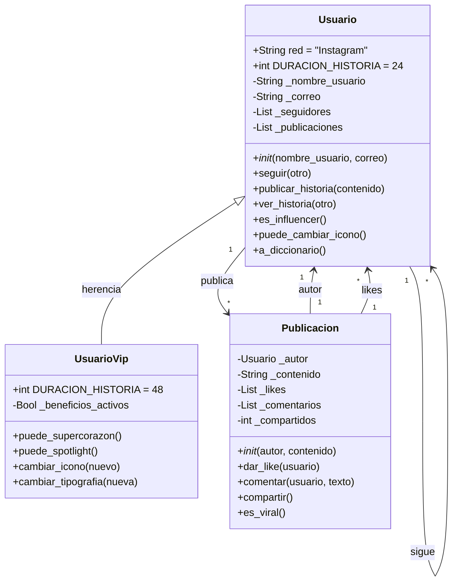

```mermaid
classDiagram
    class Usuario {
        +String red = "Instagram"
        +int DURACION_HISTORIA = 24
        -String _nombre_usuario
        -String _correo
        -List _seguidores
        -List _publicaciones
        +_init_(nombre_usuario, correo)
        +seguir(otro)
        +publicar_historia(contenido)
        +ver_historia(otro)
        +es_influencer()
        +puede_cambiar_icono()
        +a_diccionario()
    }

    class UsuarioVip {
        +int DURACION_HISTORIA = 48
        -Bool _beneficios_activos
        +puede_supercorazon()
        +puede_spotlight()
        +cambiar_icono(nuevo)
        +cambiar_tipografia(nueva)
    }

    class Publicacion {
        -Usuario _autor
        -String _contenido
        -List _likes
        -List _comentarios
        -int _compartidos
        +_init_(autor, contenido)
        +dar_like(usuario)
        +comentar(usuario, texto)
        +compartir()
        +es_viral()
    }

    Usuario <|-- UsuarioVip : herencia
    Usuario "1" --> "*" Publicacion : publica
    Publicacion "1" --> "1" Usuario : autor
    Usuario "1" --> "*" Usuario : sigue
    Publicacion "1" --> "*" Usuario : likes
```
