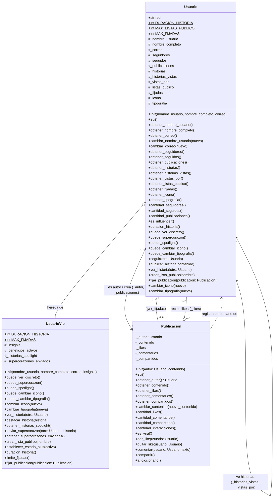

```mermaid
classDiagram
    direction TB

    class Usuario {
        +str red$
        +int DURACION_HISTORIA$
        +int MAX_LISTAS_PUBLICO$
        +int MAX_FIJADAS$
        #_nombre_usuario 
        #_nombre_completo 
        #_correo 
        #_seguidores 
        #_seguidos 
        #_publicaciones 
        #_historias 
        #_historias_vistas 
        #_vistas_por 
        #_listas_publico 
        #_fijadas 
        #_icono 
        #_tipografia 
        +__init__(nombre_usuario, nombre_completo, correo)
        +__str__() 
        +obtener_nombre_usuario() 
        +obtener_nombre_completo() 
        +obtener_correo() 
        +cambiar_nombre_usuario(nuevo) 
        +cambiar_correo(nuevo) 
        +obtener_seguidores()
        +obtener_seguidos() 
        +obtener_publicaciones() 
        +obtener_historias()
        +obtener_historias_vistas() 
        +obtener_vistas_por() 
        +obtener_listas_publico() 
        +obtener_fijadas() 
        +obtener_icono() 
        +obtener_tipografia() 
        +cantidad_seguidores() 
        +cantidad_seguidos() 
        +cantidad_publicaciones() 
        +es_influencer() 
        +duracion_historia() 
        +puede_ver_discreto() 
        +puede_supercorazon() 
        +puede_spotlight() 
        +puede_cambiar_icono() 
        +puede_cambiar_tipografia() 
        +seguir(otro: Usuario) 
        +publicar_historia(contenido) 
        +ver_historia(otro: Usuario) 
        +crear_lista_publico(nombre) 
        +fijar_publicacion(publicacion: Publicacion) 
        +cambiar_icono(nuevo) 
        +cambiar_tipografia(nueva) 
    }

    class UsuarioVip {
        +int DURACION_HISTORIA$
        +int MAX_FIJADAS$
        #_insignia 
        #_beneficios_activos 
        #_historias_spotlight 
        #_supercorazones_enviados 
        +__init__(nombre_usuario, nombre_completo, correo, insignia)
        +puede_ver_discreto() 
        +puede_supercorazon() 
        +puede_spotlight() 
        +puede_cambiar_icono() 
        +puede_cambiar_tipografia() 
        +cambiar_icono(nuevo) 
        +cambiar_tipografia(nueva) 
        +ver_historia(otro: Usuario) 
        +destacar_historia(historia) 
        +obtener_historias_spotlight() 
        +enviar_supercorazon(otro: Usuario, historia) 
        +obtener_supercorazones_enviados() 
        +crear_lista_publico(nombre) 
        +establecer_estado_plus(activo) 
        +duracion_historia() 
        +limite_fijadas() 
        +fijar_publicacion(publicacion: Publicacion) 
    }

    class Publicacion {
        -_autor : Usuario
        -_contenido 
        -_likes 
        -_comentarios 
        -_compartidos 
        +__init__(autor: Usuario, contenido)
        +__str__() 
        +obtener_autor() Usuario
        +obtener_contenido() 
        +obtener_likes() 
        +obtener_comentarios() 
        +obtener_compartidos() 
        +cambiar_contenido(nuevo_contenido) 
        +cantidad_likes() 
        +cantidad_comentarios() 
        +cantidad_compartidos() 
        +cantidad_interacciones() 
        +es_viral() 
        +dar_like(usuario: Usuario) 
        +quitar_like(usuario: Usuario) 
        +comentar(usuario: Usuario, texto) 
        +compartir() 
        +a_diccionario() 
    }

    %% Relaciones entre clases
    Usuario <|-- UsuarioVip : hereda de
    Usuario "1" <--> "0..*" Publicacion : es autor / crea (_autor, _publicaciones)
    Usuario "0..*" o-- "0..6" Publicacion : fija (_fijadas)
    Usuario "0..*" <--> "0..*" Usuario : sigue / es seguido (_seguidos, _seguidores)
    Usuario "0..*" <--> "0..*" Usuario : ve historias (_historias_vistas, _vistas_por)
    Publicacion "0..*" o-- "0..*" Usuario : recibe likes (_likes)
    Publicacion ..> Usuario : registra comentario de
```
