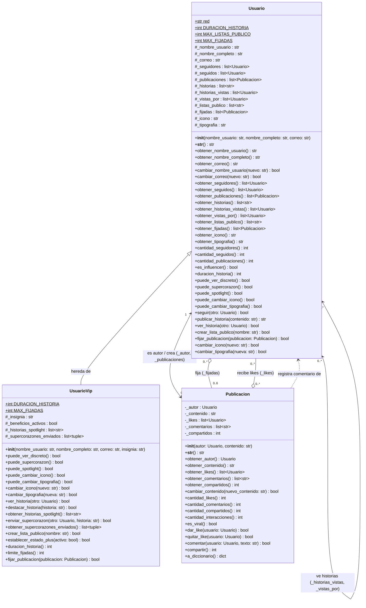

## Diagrama UML 

```mermaid
classDiagram
    direction TB

    class Usuario {
        +str red$
        +int DURACION_HISTORIA$
        +int MAX_LISTAS_PUBLICO$
        +int MAX_FIJADAS$
        #_nombre_usuario : str
        #_nombre_completo : str
        #_correo : str
        #_seguidores : list~Usuario~
        #_seguidos : list~Usuario~
        #_publicaciones : list~Publicacion~
        #_historias : list~str~
        #_historias_vistas : list~Usuario~
        #_vistas_por : list~Usuario~
        #_listas_publico : list~str~
        #_fijadas : list~Publicacion~
        #_icono : str
        #_tipografia : str
        +__init__(nombre_usuario: str, nombre_completo: str, correo: str)
        +__str__() str
        +obtener_nombre_usuario() str
        +obtener_nombre_completo() str
        +obtener_correo() str
        +cambiar_nombre_usuario(nuevo: str) bool
        +cambiar_correo(nuevo: str) bool
        +obtener_seguidores() list~Usuario~
        +obtener_seguidos() list~Usuario~
        +obtener_publicaciones() list~Publicacion~
        +obtener_historias() list~str~
        +obtener_historias_vistas() list~Usuario~
        +obtener_vistas_por() list~Usuario~
        +obtener_listas_publico() list~str~
        +obtener_fijadas() list~Publicacion~
        +obtener_icono() str
        +obtener_tipografia() str
        +cantidad_seguidores() int
        +cantidad_seguidos() int
        +cantidad_publicaciones() int
        +es_influencer() bool
        +duracion_historia() int
        +puede_ver_discreto() bool
        +puede_supercorazon() bool
        +puede_spotlight() bool
        +puede_cambiar_icono() bool
        +puede_cambiar_tipografia() bool
        +seguir(otro: Usuario) bool
        +publicar_historia(contenido: str) str
        +ver_historia(otro: Usuario) bool
        +crear_lista_publico(nombre: str) bool
        +fijar_publicacion(publicacion: Publicacion) bool
        +cambiar_icono(nuevo: str) bool
        +cambiar_tipografia(nueva: str) bool
    }

    class UsuarioVip {
        +int DURACION_HISTORIA$
        +int MAX_FIJADAS$
        #_insignia : str
        #_beneficios_activos : bool
        #_historias_spotlight : list~str~
        #_supercorazones_enviados : list~tuple~
        +__init__(nombre_usuario: str, nombre_completo: str, correo: str, insignia: str)
        +puede_ver_discreto() bool
        +puede_supercorazon() bool
        +puede_spotlight() bool
        +puede_cambiar_icono() bool
        +puede_cambiar_tipografia() bool
        +cambiar_icono(nuevo: str) bool
        +cambiar_tipografia(nueva: str) bool
        +ver_historia(otro: Usuario) bool
        +destacar_historia(historia: str) bool
        +obtener_historias_spotlight() list~str~
        +enviar_supercorazon(otro: Usuario, historia: str) bool
        +obtener_supercorazones_enviados() list~tuple~
        +crear_lista_publico(nombre: str) bool
        +establecer_estado_plus(activo: bool) bool
        +duracion_historia() int
        +limite_fijadas() int
        +fijar_publicacion(publicacion: Publicacion) bool
    }

    class Publicacion {
        -_autor : Usuario
        -_contenido : str
        -_likes : list~Usuario~
        -_comentarios : list~str~
        -_compartidos : int
        +__init__(autor: Usuario, contenido: str)
        +__str__() str
        +obtener_autor() Usuario
        +obtener_contenido() str
        +obtener_likes() list~Usuario~
        +obtener_comentarios() list~str~
        +obtener_compartidos() int
        +cambiar_contenido(nuevo_contenido: str) bool
        +cantidad_likes() int
        +cantidad_comentarios() int
        +cantidad_compartidos() int
        +cantidad_interacciones() int
        +es_viral() bool
        +dar_like(usuario: Usuario) bool
        +quitar_like(usuario: Usuario) bool
        +comentar(usuario: Usuario, texto: str) bool
        +compartir() int
        +a_diccionario() dict
    }

    %% Relaciones entre clases
    Usuario <|-- UsuarioVip : hereda de
    Usuario "1" <--> "0..*" Publicacion : es autor / crea (_autor, _publicaciones)
    Usuario "0..*" o-- "0..6" Publicacion : fija (_fijadas)
    Usuario "0..*" <--> "0..*" Usuario : sigue / es seguido (_seguidos, _seguidores)
    Usuario "0..*" <--> "0..*" Usuario : ve historias (_historias_vistas, _vistas_por)
    Publicacion "0..*" o-- "0..*" Usuario : recibe likes (_likes)
    Publicacion ..> Usuario : registra comentario de
```
